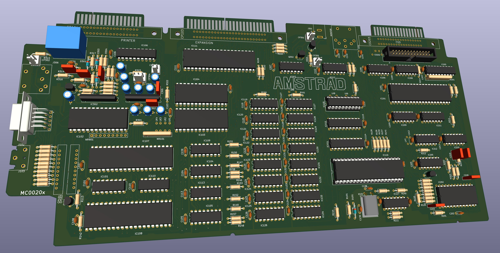

## Amstrad CPC6128 version 2 (MC0020x) schematic and pcb.

This is intended to be a reasonably accurate KiCad 6 transcription of the version 2 6128 pcb, with the 40010 Gate Array and the 24-pin disk data separator. The Amstrad service manuals don't bother to document this version, instead providing a mishmash of earlier and later revision schematics and pcb track layouts.

There are some liberties taken due to practical difficulties in reading the top layer of the PCB, so here's the priorities of this version:

- Schematic should match as closely as possible to the real board.
- All parts and part references and logical connectivity should match exactly.
- Part and via placement should match as closely as possible.
- Track routing should match closely on the bottom of the pcb.
- Track routing should be close on the top of the pcb; there will be variations where the view was obscured by components.
- Exact track poses may vary; original layout was done by hand and has varying angles; kicad layout is kept at 45 degrees.
- Track widths aren't correct everywhere; while the ground and power nets are handled by a netclass, a bunch of the tracks in the audio circuit need to have their widths manually adjusted.

Most part values should be correct, but I've not yet bothered to check any resistors - all values were copied from corresponding parts identified in the official schematics for the other revisions. Real values may be different, and additional resistors that are present but not documented elsewhere have been left with a value of "?".

